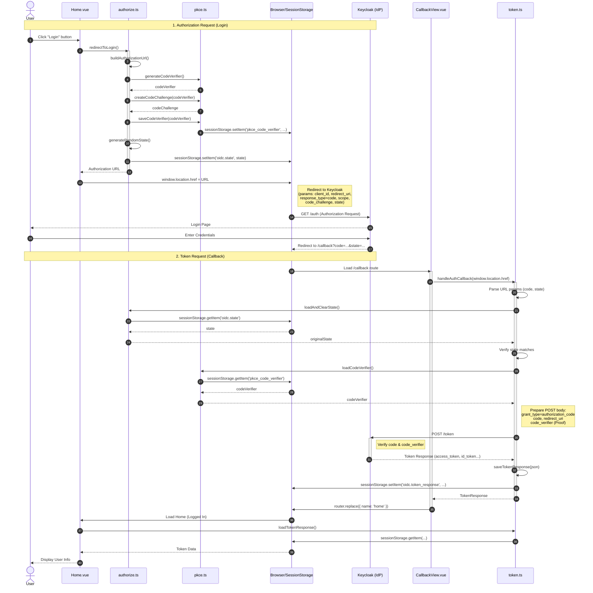

# OIDC Authorization Code Flow with PKCE Sequence Diagram

```mermaid
sequenceDiagram
    autonumber
    actor User
    participant HomeView as Home.vue
    participant AuthLib as authorize.ts
    participant PkceLib as pkce.ts
    participant Browser as Browser/SessionStorage
    participant Keycloak as Keycloak (IdP)
    participant CallbackView as CallbackView.vue
    participant TokenLib as token.ts

    Note over User, Keycloak: 1. Authorization Request (Login)

    User->>HomeView: Click "Login" button
    HomeView->>AuthLib: redirectToLogin()
    activate AuthLib
    AuthLib->>AuthLib: buildAuthorizationUrl()

    AuthLib->>PkceLib: generateCodeVerifier()
    PkceLib-->>AuthLib: codeVerifier

    AuthLib->>PkceLib: createCodeChallenge(codeVerifier)
    PkceLib-->>AuthLib: codeChallenge

    AuthLib->>PkceLib: saveCodeVerifier(codeVerifier)
    PkceLib->>Browser: sessionStorage.setItem('pkce_code_verifier', ...)

    AuthLib->>AuthLib: generateRandomState()
    AuthLib->>Browser: sessionStorage.setItem('oidc.state', state)

    AuthLib-->>HomeView: Authorization URL
    deactivate AuthLib

    HomeView->>Browser: window.location.href = URL
    Note right of Browser: Redirect to Keycloak<br/>(params: client_id, redirect_uri, <br/>response_type=code, scope, <br/>code_challenge, state)

    Browser->>Keycloak: GET /auth (Authorization Request)
    Keycloak-->>User: Login Page
    User->>Keycloak: Enter Credentials
    Keycloak-->>Browser: Redirect to /callback?code=...&state=...

    Note over User, Keycloak: 2. Token Request (Callback)

    Browser->>CallbackView: Load /callback route
    activate CallbackView
    CallbackView->>TokenLib: handleAuthCallback(window.location.href)
    activate TokenLib

    TokenLib->>TokenLib: Parse URL params (code, state)

    TokenLib->>AuthLib: loadAndClearState()
    AuthLib->>Browser: sessionStorage.getItem('oidc.state')
    Browser-->>AuthLib: state
    AuthLib-->>TokenLib: originalState
    TokenLib->>TokenLib: Verify state matches

    TokenLib->>PkceLib: loadCodeVerifier()
    PkceLib->>Browser: sessionStorage.getItem('pkce_code_verifier')
    Browser-->>PkceLib: codeVerifier
    PkceLib-->>TokenLib: codeVerifier

    Note right of TokenLib: Prepare POST body:<br/>grant_type=authorization_code<br/>code, redirect_uri<br/>code_verifier (Proof)

    TokenLib->>Keycloak: POST /token
    activate Keycloak
    Note right of Keycloak: Verify code & code_verifier
    Keycloak-->>TokenLib: Token Response (access_token, id_token...)
    deactivate Keycloak

    TokenLib->>TokenLib: saveTokenResponse(json)
    TokenLib->>Browser: sessionStorage.setItem('oidc.token_response', ...)

    TokenLib-->>CallbackView: TokenResponse
    deactivate TokenLib

    CallbackView->>Browser: router.replace({ name: 'home' })
    deactivate CallbackView

    Browser->>HomeView: Load Home (Logged In)
    HomeView->>TokenLib: loadTokenResponse()
    TokenLib->>Browser: sessionStorage.getItem(...)
    Browser-->>HomeView: Token Data
    HomeView-->>User: Display User Info
```
